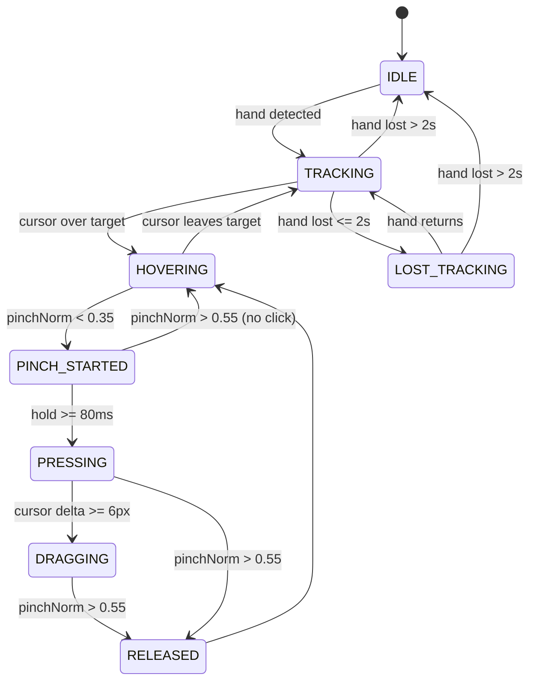
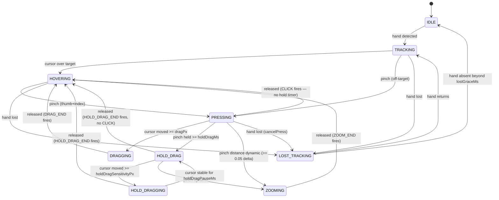

# AirVision Desktop — Gesture Specification

**Status**: Phase 0 deliverable. Authoritative source for landmark mapping, pinch math, FSM, smoothing parameters, calibration, and mouse fallback.

---

## 1. Landmark model

We use **MediaPipe HandLandmarker** (21 landmarks per hand) from `@mediapipe/tasks-vision`.

### 1.1 Landmark indices (MediaPipe standard)

```
 0  WRIST
 1  THUMB_CMC         13  MIDDLE_TIP
 2  THUMB_MCP         14  RING_MCP
 3  THUMB_IP          15  RING_PIP
 4  THUMB_TIP         16  RING_DIP
 5  INDEX_MCP         17  RING_TIP
 6  INDEX_PIP         18  PINKY_MCP
 7  INDEX_DIP         19  PINKY_PIP
 8  INDEX_TIP         20  PINKY_DIP
 9  MIDDLE_MCP        (21 = PINKY_TIP — see note)
10  MIDDLE_PIP
11  MIDDLE_DIP
12  MIDDLE_TIP
```

MediaPipe HandLandmarker emits 21 points (indices 0..20); PINKY_TIP = index 20. We reference by semantic constants to avoid magic numbers.

### 1.2 Coordinate spaces

- **Camera space**: `[0..1]`, `x` left→right, `y` top→bottom, `z` depth (negative = closer).
- **Screen space**: pixel coordinates in the renderer viewport, origin top-left.
- **Mirror correction**: when camera is mirrored (default on for natural feel), `screen.x = viewportWidth - (cameraX * viewportWidth)`.

---

## 2. Pointer mapping

The **index fingertip** (`INDEX_TIP`, landmark 8) drives the spatial cursor.

```
screenX = (cameraX * viewportWidth)  [mirrored if enabled]
screenY = (cameraY * viewportHeight)
```

Optional 4-corner calibration produces an affine transform that maps camera-space fingertip to screen-space. Calibration is stored as four `(camX, camY) ↔ (screenX, screenY)` correspondences and applied via a bilinear interpolation.

When calibration is unset, the linear mapping above is used.

---

## 3. Smoothing — One Euro Filter

The One Euro Filter is a low-pass filter with an adaptive cutoff: at low speeds it filters aggressively (cuts jitter), at high speeds it relaxes (preserves responsiveness).

### 3.1 Per-axis filter

We run one filter per axis (x, y) for the index fingertip. Optionally, also for the wrist (used for palm-normalized pinch).

### 3.2 Defaults (tunable in Settings)

| Parameter | Default | Range | Effect |
|---|---|---|---|
| `minCutoff` | 1.0 Hz | 0.5 – 5.0 | Lower = smoother but laggier |
| `beta` | 0.007 | 0.0 – 0.05 | Higher = less lag during fast motion |
| `dCutoff` | 1.0 Hz | fixed | Internal derivative smoothing |

Implementation is ~60 LOC; no external dependency.

### 3.3 Smoothing is applied **before** the FSM

This ensures the FSM never sees raw jitter.

---

## 4. Pinch math

### 4.1 Raw pinch distance

```
rawPinch = distance(thumbTip, indexTip)    // in camera-space units
```

### 4.2 Normalization (palm-relative)

Hand scale varies with distance from the camera. We normalize by palm size so the gesture works at varying depths.

```
palmSize = distance(wrist, middleMCP)      // landmark 0 → 9
pinchNorm = rawPinch / palmSize
```

Empirically, an open relaxed hand has `pinchNorm ≈ 0.9–1.0`. A hard pinch is near `0.1–0.2`.

### 4.3 Thresholds (locked defaults)

| Transition | Threshold |
|---|---|
| PINCH_START (entering) | `pinchNorm < 0.35` |
| PINCH_RELEASE (exiting) | `pinchNorm > 0.55` |
| Press dwell | `>= 80 ms` continuous pinch before a click is registered |
| Drag activation | `pinchNorm < 0.35` AND cursor moved `>= 6 px` since pinch started |
| Near-pinch (no-click guard) | `pinchNorm ∈ [0.35, 0.55]` → no state change |

### 4.4 Hysteresis

The dead-band `[0.35, 0.55]` prevents flapping when the distance oscillates around a single threshold.

---

## 5. Gesture finite state machine

### 5.1 States

| State | Description |
|---|---|
| `IDLE` | No hand visible; cursor hidden |
| `TRACKING` | Hand visible; cursor follows fingertip; no interaction |
| `HOVERING` | Cursor over a targetable element; hover styling applied |
| `PINCH_STARTED` | Pinch just detected; press-dwell timer running |
| `PRESSING` | Pinch held ≥ 80 ms; click registered if released |
| `DRAGGING` | Pinch held + cursor moved ≥ 6 px; active drag in progress |
| `RELEASED` | Brief state after release; logs the click event, returns to HOVERING |
| `LOST_TRACKING` | Hand temporarily lost (≤ 2 s); cursor hidden, no interaction |

### 5.2 Transitions

```
IDLE             ──hand detected──►                TRACKING
TRACKING         ──cursor over target──►           HOVERING
HOVERING         ──pinchNorm < 0.35──►             PINCH_STARTED
PINCH_STARTED    ──hold ≥ 80 ms──►                 PRESSING
PRESSING         ──cursor Δ ≥ 6 px──►              DRAGGING
DRAGGING         ──pinchNorm > 0.55──►             RELEASED → HOVERING
PRESSING         ──pinchNorm > 0.55──►             RELEASED → HOVERING
PINCH_STARTED    ──pinchNorm > 0.55 (before 80 ms)──► HOVERING (no click)
HOVERING         ──cursor leaves target──►         TRACKING
TRACKING         ──hand lost ≤ 250 ms──►           LOST_TRACKING
TRACKING         ──hand lost > 2 s──►              IDLE
LOST_TRACKING    ──hand returns ≤ 2 s──►           TRACKING
LOST_TRACKING    ──hand lost > 2 s──►              IDLE
```

### 5.3 Diagram



### 5.4 Guards

- Transitions are guarded by minimum confidence (`score >= 0.5`).
- Transitions are debounced: a `PINCH_STARTED` requires two consecutive frames below threshold to avoid spikes.
- The FSM is pure: input = previous state + frame, output = next state. No side effects in transitions.

---

## 6. Calibration

### 6.1 Flow

1. User opens calibration (Settings → Calibration).
2. App requests user to point at the **top-left** corner target; records `(camX, camY)`.
3. Top-right → records.
4. Bottom-right → records.
5. Bottom-left → records.
6. Compute bilinear interpolation grid → store as `calibration: { corners: [[camX,camY],[screenX,screenY]]×4 }` in settings.
7. Apply: pointer mapping uses bilinear interpolation through corners.

### 6.2 Skip behavior

If skipped, the linear mapping is used. Calibration is optional and does not block any feature.

### 6.3 Reset

Calibration is reset by an explicit button or by "Reset to defaults" in Settings.

---

## 7. Multi-hand behavior

- Up to 2 hands tracked. Primary hand = first detected by default (user can swap in Settings).
- Two-hand gestures (P2): distance between two index fingertips drives a scale factor (window resize or canvas zoom).
- When two-hand mode is off, the second hand is detected but ignored — it does not affect the FSM.

---

## 8. Mouse fallback

A real DOM mouse cursor exists alongside the hand cursor for development and accessibility.

- **Default**: hand cursor is the primary indicator; system cursor is hidden (`cursor: none`).
- **Mouse fallback mode** (Settings toggle): system cursor visible, hand cursor hidden; clicks map directly to FSM `PRESSING`/`RELEASED` transitions for parity.
- Mouse fallback is **not** for production — it's a development aid. Production mode is hand-first.

---

## 9. Lost tracking

| Condition | Behavior |
|---|---|
| Hand absent 0–250 ms | No-op; cursor stays at last position |
| Hand absent 250 ms – 2 s | Cursor fades out (250 ms opacity transition); FSM in `LOST_TRACKING` |
| Hand absent > 2 s | Cursor hides; FSM in `IDLE` |
| Confidence drops below 0.5 mid-frame | Frame dropped; smoothing retains last good position |

---

## 10. Cursor visualization states

| FSM state | Cursor visual |
|---|---|
| `IDLE` | hidden |
| `LOST_TRACKING` | fading translucent orb |
| `TRACKING` | small translucent orb, soft glow |
| `HOVERING` | orb expands ~10%, accent ring appears |
| `PINCH_STARTED` | orb compresses slightly (anticipation) |
| `PRESSING` | orb fully compressed, brighter glow |
| `DRAGGING` | orb elongates in direction of motion, trail |
| `RELEASED` | brief expand-and-contract "release" animation |

---

## 11. Settings that affect the gesture system

| Setting | Default | Range | Effect |
|---|---|---|---|
| Smoothing amount | 0.5 (mapped to One Euro params) | 0.0–1.0 | Higher = smoother, lower = snappier |
| Pinch sensitivity | 0.5 | 0.0–1.0 | Adjusts thresholds symmetrically |
| Cursor sensitivity | 1.0 | 0.5–2.0 | Multiplies cursor delta before applying to screen |
| Hand visibility debug | off | bool | Shows landmarks + skeleton |
| Mouse fallback | off | bool | Replaces hand cursor with system cursor |
| Dwell delay | 80 ms | 40–200 ms | Press dwell time |
| Two-hand gestures | off | bool | Enables P2 multi-hand gestures |

---

## 12. Pinch gesture taxonomy (Phase 21)

### 12.1 Why pinch replaces dwell

The original `dwellMs`-based click had a "ring stops at 2/3" bug: the FSM reset
`hoverStartedAt` every frame after `HOVERING` re-entered, so the dwell window never
ran to completion in one continuous stroke. The replacement uses **pinch** as the
primary click trigger — the click ring's progress is monotonic in `pinchHoldMs` and
resets cleanly when the user releases.

### 12.2 Pinch state machine

The full gesture FSM (in [`src/renderer/src/gestures/stateMachine.ts`](src/renderer/src/gestures/stateMachine.ts))
operates on top of the `PinchDetector` (in [`src/renderer/src/gestures/PinchDetector.ts`](src/renderer/src/gestures/PinchDetector.ts)).



### 12.3 Disambiguation table

| User intent | Gesture | Detection |
|---|---|---|
| **Click** | Pinch + release (any duration) | `PRESSING` state, release detected — original behavior |
| **Drag** | Pinch + move > `dragPx` before `holdDragMs` | `PRESSING → DRAGGING` |
| **Hold-drag** | Pinch held > `holdDragMs` without moving, then move | `PRESSING → HOLD_DRAG → HOLD_DRAGGING` |
| **Pinch zoom** | Pinch + distance changes >= `activateDelta` (0.05) | `PRESSING → ZOOMING` |

### 12.4 Cursor rings

The SpatialCursor renders **two concentric SVG rings** while pinching:

- **Inner ring** (radius 12, green `#6AA9FF`): click-armed indicator. Appears as a
  fully filled green ring the instant the user enters `PRESSING` — click will
  fire on any release (original behavior; no countdown).
- **Outer ring** (radius 18, orange `#FFB66A`): hold countdown, `pinchHoldMs / holdDragMs`.
  Turns green and pulses once the user has held long enough to enter HOLD_DRAG mode.

When `HOLD_DRAG` is armed, the core dot is replaced with a grab-hand SVG icon
(see [`src/renderer/src/components/SpatialCursor.tsx`](src/renderer/src/components/SpatialCursor.tsx)).

### 12.5 Settings

| Setting | Default | Effect |
|---|---|---|
| `clickHoldMs` | 0 | (legacy) ms pinch must be held before click is armed. Now 0 — click fires on any pinch release. The 3s hold timer is reserved exclusively for HOLD_DRAG. |
| `dragPx` | 6 | px cursor movement to start DRAGGING |
| `holdDragMs` | 3000 | ms pinch must be held (no movement) to enter HOLD_DRAG |
| `holdDragSensitivityPx` | 4 | px movement required to start HOLD_DRAGGING |
| `zoomMin` | 0.5 | minimum scale (×) for pinch-zoom |
| `zoomMax` | 2.5 | maximum scale (×) for pinch-zoom |
| `pinchZoomEnabled` | true | enable/disable pinch-zoom gesture |

All defaults live in [`src/shared/types/index.ts`](src/shared/types/index.ts) and
[`src/main/persistence/SettingsService.ts`](src/main/persistence/SettingsService.ts).

---

## 13. Out-of-scope gestures (v1)

- Custom user-defined gestures.
- Swipe gestures (deferred to P2; useful for window switching).
- Open-palm "cancel" gesture (P2).
- Voice control.
- Head-tracking cursor offset.
